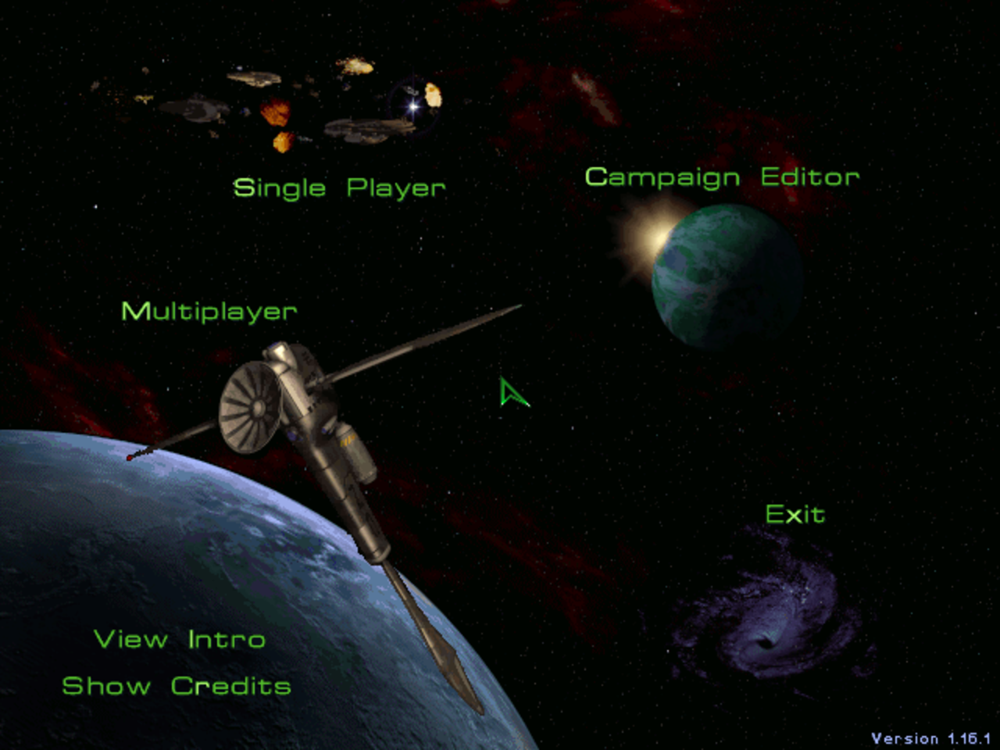

# StarCraft: Brood War 1.16.1 on Apple Silicon Mac

Getting the legacy pre-Remastered **StarCraft: Brood War 1.16.1** running on an
Apple Silicon Mac via **CrossOver 26.1.0** and Wine's builtin DirectDraw.

Tested on macOS 15.6.1 Sequoia, M-series Mac, 2026-05-23. This is not a
general compatibility promise for Intel Macs, macOS 16+, newer CrossOver builds,
or StarCraft Remastered.

No game files are included in this repo. You need to provide your own legal copy
of StarCraft + Brood War.

## Status

| Aspect | State |
|---|---|
| Launches | Working via CrossOver 26.1.0 |
| Intro video progression | Working; Esc advances through intro segments |
| Main menu | Working; real macOS window capture shows 1.16.1 menu |
| Menu mouse activation | Not proven |
| In-game play | Not proven |
| Whisky / GPTK 1.1 | Not working; Wine 7.7 `alloc_pages_vprot` crash |



## TL;DR

1. Install CrossOver 26.1.0:

   ```sh
   brew install --cask crossover
   ```

2. Create a Windows XP-template CrossOver bottle:

   ```sh
   ./scripts/create-crossover-bottle.sh
   ```

3. Extract your StarCraft 1.16.1 + Brood War files into:

   ```text
   ~/Library/Application Support/CrossOver/Bottles/starcraft-bw/drive_c/Games/StarCraft/Starcraft/
   ```

4. Launch:

   ```sh
   ./scripts/launch-starcraft.sh
   ```

5. Press Esc three or four times to skip through the intro sequence. The
   StarCraft/Brood War 1.16.1 main menu should render.

## Environment

| Component | Tested value |
|---|---|
| Mac | Apple Silicon |
| macOS | 15.6.1 Sequoia |
| CrossOver | 26.1.0 |
| Bottle | Windows XP |
| Rendering path | CrossOver builtin DirectDraw |
| Game version | StarCraft: Brood War 1.16.1 |

CrossOver is commercial software; the orchestrator brief recorded it as paid
software at $74. The tested path used CrossOver 26.1.0, not Whisky. Whisky/GPTK
is free, but it did not launch this game in the tested environment.

## Game Files

The run used the no-install StarCraft + Brood War 1.16.1 package commonly found
as `StarcraftBWNoInstall` on archive.org. The archive observed during testing was
about 1.27 GB and contained a RAR payload with password `NoInstall`.

This repo does not mirror or link the game archive. Verify that your copy is
legitimate in your jurisdiction and extract it yourself.

Expected final layout:

```text
~/Library/Application Support/CrossOver/Bottles/starcraft-bw/
└── drive_c/
    └── Games/
        └── StarCraft/
            └── Starcraft/
                ├── StarCraft.exe
                ├── BroodWar.mpq
                ├── StarDat.mpq
                └── ...
```

The nested `StarCraft/Starcraft/` directory mirrors the tested archive layout.
If your install has `StarCraft.exe` somewhere else, set `GAME_DIR` when running
the launcher:

```sh
GAME_DIR="$HOME/Library/Application Support/CrossOver/Bottles/starcraft-bw/drive_c/path/to/game" \
  ./scripts/launch-starcraft.sh
```

## Full Recipe

### 1. Install CrossOver

```sh
brew install --cask crossover
```

The orchestrated test copied CrossOver to `/tmp` with quarantine removed:

```sh
ditto --noqtn /Applications/CrossOver.app /tmp/crossover-runtime/CrossOver.app
```

That was for autonomous command-line execution only. A normal local install can
use `/Applications/CrossOver.app` directly.

### 2. Create the bottle

```sh
./scripts/create-crossover-bottle.sh
```

The script runs CrossOver's `cxbottle` with `--template winxp` and sets
`"AntiVirusScan" = "never"` in the bottle config. That setting was required in
the test environment because CrossOver's pre-run ClamAV integration aborted
before Wine launched the game when no local ClamAV database existed.

Equivalent manual commands:

```sh
CX_ROOT="/Applications/CrossOver.app/Contents/SharedSupport/CrossOver"
"$CX_ROOT/bin/cxbottle" --bottle starcraft-bw --create \
  --description "StarCraft Brood War 1.16.1" \
  --template winxp
```

Then edit:

```text
~/Library/Application Support/CrossOver/Bottles/starcraft-bw/cxbottle.conf
```

and set:

```ini
[CrossOver]
"AntiVirusScan" = "never"
```

### 3. Extract the game

Extract your StarCraft 1.16.1 + Brood War files into:

```sh
mkdir -p "$HOME/Library/Application Support/CrossOver/Bottles/starcraft-bw/drive_c/Games/StarCraft"
```

Final executable path should be:

```text
~/Library/Application Support/CrossOver/Bottles/starcraft-bw/drive_c/Games/StarCraft/Starcraft/StarCraft.exe
```

If the archive leaves `ddraw.dll` / cnc-ddraw files in the game folder from a
previous experiment, move them aside for this recipe. The proven path used
CrossOver's builtin DirectDraw, not native cnc-ddraw.

### 4. Launch

```sh
./scripts/launch-starcraft.sh
```

Equivalent manual launch:

```sh
CX_ROOT="/Applications/CrossOver.app/Contents/SharedSupport/CrossOver"
GAME_DIR="$HOME/Library/Application Support/CrossOver/Bottles/starcraft-bw/drive_c/Games/StarCraft/Starcraft"
cd "$GAME_DIR"
"$CX_ROOT/bin/wine" --bottle=starcraft-bw --workdir "$GAME_DIR" --cx-app=StarCraft.exe
```

Skip intro segments with Esc. In the successful run, repeated Esc input advanced
through multiple intro screens into the main menu.

## Proof

| File | What it shows |
|---|---|
| [`screenshots/main-menu-crossover-1.16.1.png`](screenshots/main-menu-crossover-1.16.1.png) | StarCraft/Brood War main menu, version 1.16.1 visible lower-right |
| [`screenshots/intro-to-menu-montage.png`](screenshots/intro-to-menu-montage.png) | Intro progression into menu during the CrossOver run |

Visible main-menu items in the capture:

- Single Player
- Multiplayer
- Campaign Editor
- Exit
- View Intro
- Show Credits

## Why CrossOver, Not Whisky

Whisky/GPTK 1.1's Wine 7.7 hit this assertion immediately when launching
`StarCraft.exe`:

```text
alloc_pages_vprot
```

Five GPTK-side attempts hit the same wall or failed before launch:

| Attempt | Result |
|---|---|
| Default GPTK 1.1 / Wine 7.7 | `alloc_pages_vprot` crash |
| Windows XP / XP64 bottle variant | Same crash |
| `WINEPRELOADRESERVE` experiment | Did not resolve launch |
| PE `LARGEADDRESSAWARE` patch | Did not resolve launch; restored |
| Native cnc-ddraw windowed OpenGL config | Did not resolve Wine 7.7 crash |
| Fresh GPTK64 prefix | Same crash |

CrossOver 26.1.0's patched Wine runtime bypassed that VM allocation failure.
Native cnc-ddraw inside CrossOver did not produce a visible StarCraft window in
the retry run; CrossOver builtin DirectDraw did.

## Remaining Walls

| Wall | Current state |
|---|---|
| Mouse clicks on menu items | Not proven. `cliclick`, Peekaboo window clicks, scaled coordinate variants, and keyboard shortcuts left the menu unchanged. Frame diffs matched animated background changes, not a menu transition. |
| In-game play | Not tested. Do not assume campaign/skirmish works until mouse targeting or another menu navigation path is solved. |
| Fullscreen/input capture | Likely part of the mouse issue. The successful evidence used targeted window-id capture of CrossOver's Brood War window. |
| Whisky/GPTK | Still blocked on Wine 7.7 VM bitmap / allocation behavior for this 32-bit game. |

Promising next branch: keep CrossOver builtin DirectDraw, force a true windowed
Wine surface or use a Wine-side input mechanism so StarCraft receives absolute
mouse movement/clicks. The menu coordinate used for Single Player in the test
surface was approximately `x=210 y=121` in the StarCraft-rendered surface.

## Repo Layout

```text
.
├── README.md
├── screenshots/
│   ├── intro-to-menu-montage.png
│   └── main-menu-crossover-1.16.1.png
└── scripts/
    ├── create-crossover-bottle.sh
    └── launch-starcraft.sh
```

## License

The documentation and scripts in this repository are MIT licensed. StarCraft,
Brood War, Blizzard assets, CrossOver, Wine, and any third-party tools remain
under their own licenses. No game files are included.
